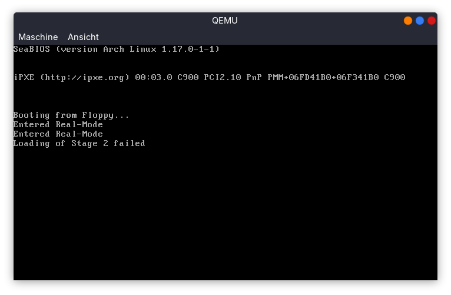

# StudyOS
This project is a playground for x86 based boot process, development tools and OS topics. The main intention is to learn and experiment with tools and x86 OS related topics.

> [!IMPORTANT]
> This project has neither the target to create any usefull OS nor a full working/full featured OS. Instead the main purpose is to experiment with some tools like the Meson build system, GNU Compiler Toolchain or ImHex Editor and also get some knowledge about x86 internals and OS concepts.

> [!NOTE]
> All the information I've written down in the the different Markdown documents in the `doc/` folder and the source code itself is based on what I could figure out and what worked for me (respectively on my machine ;-)). If anything might be wrong or not prices enough, please let me know!

## Development Goals
As already mentioned, the primary development goal is not to develop the next OS which is usefull in any term. Instead, it is used to learn about basic x86 concepts and the usage of some tools.

 * Understand the memory segmentation of the x86 in Real-Mode
 * Get a knowledge of the difference of Real-Mode and Protected Mode and how to use them
 * Learn how the Interrupt Descriptor Table and the Global Descriptor Table work
 * Get a better understanding of the x86 assembly language and the toolchain
 * Learn how different tools work and what can be done with them
 * Understand the boot process of a x86 based system
 * Get a detailed knowledge of hardware related topics like Interrupt Controller, Periodic Intervall Timer, Video Memory, Disks, Floppy Controller etc.
 * Learn something about the internals of simple file systems like FAT

## Information and Background Knowledge
The following resources are really helpful and useful if you want to dive into the OS development and low level programming topics.
 * [OSDev Wiki](https://wiki.osdev.org/Expanded_Main_Page)
 * [Writing a Bootloader from Scratch](https://www.cs.cmu.edu/~410-s07/p4/p4-boot.pdf)
 * [ELF File Format](https://github.com/compilepeace/BINARY_DISSECTION_COURSE/blob/master/ELF/ELF.md)
 * [Introduction to the GNU Assembler](https://students.mimuw.edu.pl/~zbyszek/asm/arm/assembler-intro.pdf)
 * [Experimenting with GCC Linker](https://www.robopenguins.com/linker-exploration/)
 * [Special ELF Sections](https://refspecs.linuxbase.org/LSB_3.1.0/LSB-Core-generic/LSB-Core-generic/specialsections.html)
 * [Proper way to debug 16-Bit Code on QEmu + GDB](https://gist.github.com/Theldus/4e1efc07ec13fb84fa10c2f3d054dccd)

### StudyOS Documents
I tried to document the internals of the different software components, details on the tools used for development and analysis and also provide some general background information about relevant topics. You can find the documents in the `doc/`sub-folder
 * General Information
   * [Coding Guidelines](doc/development/CodingGuidelines.md)
   * [Bootsector](doc/development/Bootsector.md)
   * [Floppy Disk Layout](doc/development/Floppy_Disk.md)
   * [BIOS Data Area](doc/development/BDA.md)
 * Tools
   * [Assembler](doc/tools/Assembler.md)
   * [Eclipse](doc/tools/Eclipse.md)
   * [ImHex](doc/tools/ImHex.md)
   * [Meson Build System](doc/tools/Meson.md)
   * [QEmu System Emulator](doc/tools/QEmu.md)
 * Components
   * [Bootdisk](doc/components/Bootdisk.md)
   * [Stage 1 Bootloader](doc/components/Bootloader/Stage1.md)
   * [Stage 2 Bootloader](doc/components/Bootloader/Stage2.md)
 * Knowledge Base
   * [Knowledge Base Collection](doc/Knowledge_Base.md)

## Requirements
The project has been developed using an Arch Linux system, but it should work on any OS where the following tools are available
 * Bash Shell for some scripts
 * Commandline tools like dd and sudo
 * mkfs.fat to create a file system
 * [GNU Toolchain](https://gcc.gnu.org/) incl. gcc, gas, ld and gdb
 * [QEmu](https://www.qemu.org/) for x86 System
 * [Meson](https://mesonbuild.com/) and [Ninja](https://ninja-build.org/) Build System
 * [Python](https://www.python.org/) for some helper scripts
 * [ImHex](https://github.com/WerWolv/ImHex) HexEditor

## Quick Build Instruction
The different parts of the OS (e.g. bootloader, kernel etc.) can be build using the [Meson Build System](https://mesonbuild.com/)

Clone the StudyOS repository

`$ git clone https://github.com/asschmidt/StudyOS.git`

Change into the project directory

`$ cd StudyOS`

Now, run Meson to prepare the build. This creates a `build`directory including the prepared build files.

`$ meson setup build`

After the preparation of Meson, the build process can be started by changing into the `build` sub-directory and run Ninja. At first, the boot floppy image must be created.

`$ ninja floppy`

As soon as the boot image is created, the file system must be created on one of the partitions on the foppy disk image. This is done with the following build command

`$ ninja fs`

> [!IMPORTANT]
> This build commands runs a scripts which uses `sudo` to setup a loop-device and you have to enter your root password. Check `tools/scripts/generate_fat.sh` for more details.

As soon as the floppy image including the file system is prepared, the different SW parts of the OS can be built. Hereby, the already created disk image is used and updated. Therefore it is not needed to re-create the floppy for each build. Only after a `clean`, the floppy image and file system must be re-created

For example, the following command builds the Stage 1 bootloader and writes it to the disk image.

`$ ninja stage1`

Possbile build targets are:
 * `stage1` - Builds Stage 1 Bootloader and writes it to the disk image
 * `stage2` - Builds Stage 2 Bootloader and writes it to the disk image
 * `floppy`- Creates 1,44 MB floppy image incl. paritions
 * `fs`- Creates the file system on Boot Floppy partion

To quickly test the Stage 1 Bootloader, the following command can be used to run QEmu with the generated disk image

`$ qemu-system-i386 -fda boot_floppy.img -boot order=a -no-fd-bootchk -D ./log.txt`

If only the Stage 1 bootloader was built, the following outputs should be visible on the QEmu window

