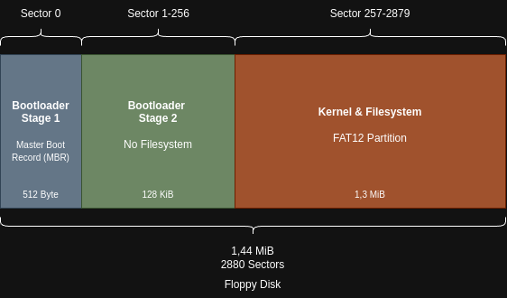

# Boot Disk
StudyOS uses a simple 1,44 MiB floppy disk as primary boot disk and filesystem. The build system of StudyOS provides build targets and scripts to generate the boot disk image.

The boot disk consists of three different areas whereby the Master Boot Record with our Stage 1 Bootloader is mandatory for every bootable floppy disk. But the partions and their usage are based on some design decisions I made. The following lists summarizes briefly the major design decisions respectively some requirements:
 * The inital version of StudyOS uses only a simple, single floppy disk
 * The boot process shall contain a Stage 1 and Stage 2 bootloader. Hereby, Stage 1 is the MBR bootloader and Stage 2 is loaded by Stage 1 and does some additional initialization and loads the actual kernel
 * A FAT12 file system is used

Considering the above constraints, I decided to split the boot floppy disk into MBR and two additional partions.

As the image shows, there are two partitions on the floppy disk. I know, usually there are no paritions on a floppy disk, but this makes the implementation of Stage 1 and Stage 2 bootloader very simple but still pretty flexible.

> [!IMPORTANT]
> The picture uses zero-based indexing of the sectors because the tool parted, which I used to create the partitions, uses zero-based sector indexing. The sector adressing with the BIOS uses one-based sector indexing!

## Bootloader Stage 1
The Stage 1 bootloader is located in the Master Boot Record and will be automatically loaded and executed by the BIOS during startup. The MBR is restricted to one sector and therefore the size is limited to 512 Byte. As shown in more detail in the [Bootsector](../development/Bootsector.md) document, the actual availble size for bootloader code is only 440 Byte due to additional data like the partition table and other data bytes.

Due to these size limitation of the Stage 1 Bootloader, it only performs a couple of basic initialization steps (see [Stage 1 Bootloader](../components/Bootloader/Stage1.md) for more details) and then loads the Stage 2 bootloader. To make this loading process easy and in some constraints a little more flexible, the Stage 1 bootloader uses the partition table (part of the MBR), to find the correct sector and size of the data it needs to load for Stage 2. That makes it possible to just adapt the Stage 2 partition in size and position, depending on the needs, but leaves the Stage 1 bootloader untouched because all information to load Stage 2 are part of the parition table.

> [!NOTE]
> The current implementation of the Stage 1 Bootloader has a size limitation of 64 KiB for loading Stage 2. This is because of 16 Bit constraints ;-) and kepts the implementation in a first draft pretty simple. I'll fix that later.

## Bootloader Stage 2

