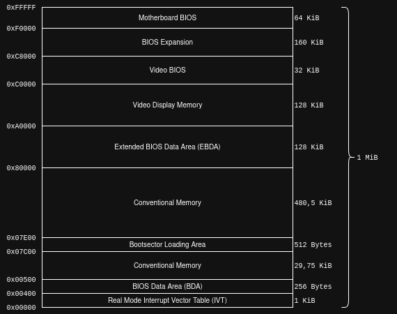
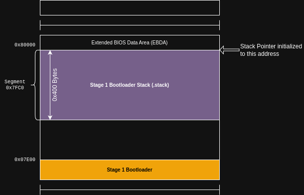

# Stage 1 Bootloader
In this document, the Stage 1 Bootloader for StudyOS is described. Hereby, a couple of background information are provided. However, it is assumed that the following topics are more or less known
 * Real-Mode and Protected-Mode
 * x86 Segmented Memory with Segment-Register

Again, a great source for information about the above mentioned topics is [OSDev Wiki](https://wiki.osdev.org/Expanded_Main_Page). The following links provide some basic information about Protected-Mode and segmented memory.
 * [System Initialization](https://wiki.osdev.org/System_Initialization_(x86))
 * [Real-Mode](https://wiki.osdev.org/Real_Mode)
 * [Protected-Mode](https://wiki.osdev.org/Protected_Mode)
 * [Segmention](https://wiki.osdev.org/Segmentation)
 * [Segment Limits](https://wiki.osdev.org/Segment_Limits)

## PC Startup
After a reset or power-cycle, the i8086 processor starts the execution always on a specific address. This is, written as linear address, the address `0xFFFF0` which is the same address as the address `0xFFFF:0x00000` written with a segment part and an offset. This address is loaded in the Code-Segment register and the Instruction Pointer, whereby the `CS` register (Code Segment) is loaded with `0xFFFF` and the `IP` register (Instruction Pointer) is loaded with `0x0000`.

You can easily prove that both addresses are the same, by calculating for example the linear address of `0xFFFF:0x0000` with the following calculation:

`LinearAddress = (Segment-Address * 16) + Offset`

Hereby, the Segment-Address is the value in the `CS` register and the offset is the value in the `IP` register. Putting those numbers in, we get

`LinearAddress = (0xFFFF * 16) + 0x0000 = 0xFFFF0 + 0x0000 = 0xFFFF0`

Looking at a standard memory map of a PC, we can clearly see, that the address, where the processor starts the execution, is located in the "Motherboard BIOS" section.

> [!NOTE]
> The addresses shown in the memory map are linear addresses and due to no paging or any other memory management concept, those linear address correspond also to physical addresses.



> [!TIP]
> The address `0xFFFF0` is also the same address where GDB pops up when we start a debugging session with QEmu and Eclipse. See [Eclipse Setup](../../tools/Eclipse.md)

The BIOS code, which is executed directly after a reset or power-cycle, usually initializes some hardware and peripherals and starts loading the Master Boot Records from the devices in the search list of the BIOS until a valid boosector is found.

> [!NOTE]
> The described boot process with the initialization by the BIOS is super simplified and only valid for an old/non-modern PC. Modern BIOSes do much more, switch to Protected-Mode and back to Real-Mode and so on. For our purposes, we just look at the simplest one where the BIOS runs in Real-Mode, does some HW stuff and loads our bootsector and starts the execution of the bootsector code.

## Stage 1 Memory Layout
Usually, if you search for simple bootloader, you'll find examples which consists of a single assembly file. This assembly file gets assembled into a `.bin` file and writte into the boot sector of your floppy and et voilá, you system is able to start the boot sector during bootup.

This process is also explained in [Babystep 1](https://wiki.osdev.org/Babystep1) from OSDev Wiki. Hereby, the boot loader source file contains also the signature, fill bytes and the actual code. The assembly process with NASM is pretty simple

```
$ nasm boot.asm -f bin -o boot.bin
```

After assembling the source file into a `.bin` file, it can be written to the floppy disk

```
$ dd if=boot.bin of=/dev/fd0
```

And the bottomline of this story is: This works great and you get a working bootloader. But for my purposes, I wanted to utilize the GNU Toolchain and some Linux tools with their great features and capabilities. Therefore, I used, beside the actual bootloader source file, also a Linker Script for the Linker and commandline tools to create the floppy image including signature bytes and partition table.

## Linker Script
One big advantage of using a Linker Script is, that you have full control and a maximum flexibility about the memory layout you want to use. Another hot topic is: With the Linker Script and some assembly coding guidelines it is possible to utilize the "Dead Code Elimination" feature from the linker. That feature makes it possible to use libraries and include their functions, even in the bootloader, and finally, only the called/used functions are kept in the binary. If you split your code across different source files and use the assembler `.include` directive (doesn't matter if its NASM oder GNU Assembler) all functions will be part of the binary, independent whether they get called or not.

### Memory Map
As a foundation for the Linker Script, I created a memory map which I would like to use for my Stage 1 bootloader. The memory map is shown in the following picture.


In principle, there are 3 major memory areas which are related to the Stage 1 bootloader.

| Memory Area   | Memory Section      | Usage                                                             |
| ------------- | ------------------- | ----------------------------------------------------------------- |
| Stage 1 Code  | `.text` and `.data` | Contains the actual bootloader code and the initialized variables |
| Stage 1 RAM   | `.bss`              | Contains the RAM section which is used for unitialized variables  |
| Stage 1 Stack | `.stack`            | Contains the RAM memory which is used for the stack               |

#### Stage 1 Code
The bootloader code is loaded into the memory by the BIOS. Hereby, the BIOS uses the fixed target address `0x007C0` to load the bootloader respectivly the 512 Bytes from the boot sector. This address cannot be modifed and therefore, we have to put our `.text` section at this address.

Another important aspect of this memory area is, that is must also contain our initialized variables. The reason for that is: A variable is just a location in the RAM (it must be writeable and readable). But after a reset/powercycle the RAM usually has undefined content and the question now is, how do we get our initial values into this memory area after a reset/powercycle?
For the Stage 1 bootloader this is pretty simple: The BIOS loads the complete boot sector into the RAM of the PC (at the specified location) and due to the fact that it is loaded into RAM, we can use any memory location as a variable. So what we do now, is just put our initial values, together with the code, in the boot sector which is loaded by the BIOS into memory. However, we need to consider the limited space we have in the boot sector and every initialized variable reduces the available code space. To distinguish between the actual code and the initial values, we use different sections. The code goes into `.text`  whereby the inital values for variables goes into `.data`.

#### Stage 1 RAM
The bootloader needs also sometimes variables to store information and data for further processing. This is realized by providing a `.bss` section where the assembler can put variables in. This memory section is not initialized. But due to the fact that it is not initialized, we can use much more than we have in the `.data` section because we can place the `.bss` section in any unsued memory area of the PC.

For the Stage 1 bootloader I put the `.bss` memory section in a unused memory area between the BIOS Data Area and the bootloader code itself. The reserved area occupies 28 KiB. This is way too much for the Stage 1 bootloader but we will also re-use this area for Stage 2.

#### Stage 1 Stack
This memory area is really super special and completely unusual for a bootloader. In most simple bootloaders, only the Stack-Pointer of the processor is set to a fixed address and starting on this address, the processor manages the Stack-Pointer during `push` and `pop` instructions.

Based on my experience on embedded system, I'm used to pay special attention to the stack memory. And a good practice in embedded systems is to place the stack memory at the end of a RAM area because in most cases, the processors implement a descending stack, which means for each `push` operation onto the stack, the stack pointer is decremented and therefore moves from higher to lower addresses.
But instead to just initialize the processors's stack pointer, I decided to get some support from the linker during address calculation and therefore I can move my stack area around the memory by just adapting the Linker Script and I don't have to change my code for the bootloader.

### Common Linker Script Definitions
Looking at the Linker Script [`src/bootloader/stage1/stage1.ld`](../../../src/bootloader/stage1/stage1.ld), a lot of symbol definitions take place right in the beginning of the file. This is the same concept as for any other source file: Don't use magic numbers, instead try to use symbols and constants

```
/*
 * Defines the start address and size of the Stage 1 bootloader
 * These values are pre-defined by the BIOS and cannot be changed
 */
BOOT_ADDRESS        = 0x7C00;
BOOTLOADER_LENGTH   = 440;

/*
 * Defines the memory address for the Stage2 bootloader. The Stage1
 * bootloader will load the binary of the Stage2 bootloader into this
 * memory address and jumps to this address to execute Stage2
 */
BOOTLOADER_STAGE2_ADR     = 0x7E00;
BOOTLOADER_STAGE2_OFFSET  = 0x0;
BOOTLOADER_STAGE2_SEGMENT = (BOOTLOADER_STAGE2_ADR - BOOTLOADER_STAGE2_OFFSET) / 16;
BOOTLOADER_STAGE2_LENGHT  = 64K;

/*
 * Defines the start address and size for the RAM used by the Stage1
 * Bootloader. This covers the .bss section The .data section contains
 * initialized variables and must be loaded into memory. Therefore the
 * .data section must reside in the bootloader binary
 */
BOOT_RAM_ADR        = 0x0500;
BOOT_RAM_SIZE       = 28K;

/*
 * Defines the address (offset and segment) and size of the Stack for Stage1
 * Bootloader.
 * Remark: This is an address > than 16 Bit and must be recalculated in segement/
 * offset pair for usage in the bootloader code. The Linker can handle the adress
 * calculations for the stack with more than 16 Bit.
 */
BOOT_STACK_ADR      = 0x7FC00;
BOOT_STACK_SIZE     = 1K;

/*
 * Define the offset for the stack segment (Offset 0x400 = 1 KiB --> Last address in Stack)
 * and calculate the corresponding segment for the physical address of the stack
 * based on the chosen offset
 */
BOOT_STACK_OFFSET   = 0x0;
BOOT_STACK_SEGMENT  = (BOOT_STACK_ADR - BOOT_STACK_OFFSET) / 16;
```
As it can be seen in the code snippet, all major addresses for Code, RAM and Stack are hard-coded in the linker file. These addresses, to be more precise, the actual symbols are used in the next step to define a memory structure for the Linker.

### Memory Areas
In the memory structure for the Linker, all the memory areas, shown in the memory map picture, are defined. There is a RAM, Code and Stack area. Additionally, a `DUMMY` area is defined to allow the Linker to store special debug and symbol infos. This memory area is not used by the actual bootloader code, but helps debugging and provides some options to store additional data for tools.

```
MEMORY
{
    /* Memory Areas for Stage1 Bootloader */
    BOOTLOADER_RAM (rw) : ORIGIN = BOOT_RAM_ADR,        LENGTH = BOOT_RAM_SIZE
    BOOTLOADER (rwx)    : ORIGIN = BOOT_ADDRESS,        LENGTH = BOOTLOADER_LENGTH
    BOOTLOADER_STACK(rw): ORIGIN = BOOT_STACK_ADR       LENGTH = BOOT_STACK_SIZE

    /* Dummy Memory region to store sections not part of the final binary */
    /* The address space of this region doesn't really matter, we should
       just move it our of the way from everything else */
    DUMMY (rwx)         : ORIGIN = DUMMY_ADDRESS,       LENGTH = 10M
}
```

### External Linker Symbols
The next part of the Linker Script defines symbols, which are used in other modules like the actual bootloader code. According to the [Guiding Guidelines](../../development/CodingGuidelines.md), the Linker Symbols for external usage shall have an underscore prefix and lower case letters

```
/* Define the size of the Stack used by the Stage1 Bootloader */
_boot_stack_offset  = BOOT_STACK_OFFSET;
_boot_stack_segment = BOOT_STACK_SEGMENT;
_boot_stack_size    = BOOT_STACK_SIZE;

/* Symbols used in Stage1 Bootloader to setup the complete RAM area */
_ram_start        = ORIGIN(BOOTLOADER_RAM);
_ram_size         = LENGTH(BOOTLOADER_RAM);

/* Define the addresses (segment + offset) for the Stage2 Bootloader */
_boot_stage2_offset  = BOOTLOADER_STAGE2_OFFSET;
_boot_stage2_segment = BOOTLOADER_STAGE2_SEGMENT;
_boot_stage2_length  = BOOTLOADER_STAGE2_LENGHT;
_boot_stage2_max_sector_count = BOOTLOADER_STAGE2_LENGHT / 512;
```

### Memory Sections
The last part of the Linker Script is the definition of the output sections for the linker. These output sections configure how and where the linker should put the different portions of the software. The following code snippet just shows an excerpt from the sections

```
SECTIONS
{
    /* .text section containing the Stage1 bootloader code */
    .text :
    {
        /*
         * Create a symbol to define the memory address of the begining of
         * the MBR. Basically this value is fixed to 0x7C00 but it is more
         * elegant to provide a linker-calculated symbol (also good for cross
         * checking whether the memory layout of the .text sections is correct)
         */
        _mbr_address = .;

        /* Insert all .text.* input sections */
        *(.text);
        *(.text.*);
    } > BOOTLOADER

    /* .rodata section containing the read-only (constant) data */
    .rodata :
    {
        . = ALIGN(4);
        /* Insert all .rodata input sections */
        *(.rodata);
        . = ALIGN(4);
    } > BOOTLOADER

    /* .data section containing all initialized variables */
    .data :
    {
        . = ALIGN(4);
        /* Insert all .data input sections */
        *(.data);

        . = ALIGN(4);
    } > BOOTLOADER
```

Two important aspects are configured in the section definition. The first one is, in which memory area the section should go and the second one is, what content should be in that section. In the snippet of the Linker Script above, only sections which are located in the `BOOTLOADER` memory area are shown. That is the memory part in the system RAM where the BIOS will load the bootsector. As it can be seen, beside the `.text` section containing the executable code, also the `.data` and `.rodata` sections are located in this memory area.

The next snippet shows two additional sections of the bootloader which are located in the `BOOTLOADER_RAM` area and the `BOOTLOADER_STACK` area.

```
/* .bss section used to store uninitialized variables */
    .bss :
    {
        . = ALIGN(4);

        /* Define a symbol to mark the start of the .bss section */
        _bss_start = .;

        /*
         * Insert all .bss input sections
         * Hereby, only space is reserved and no actual data is stored in the ELF
         * binary for this section.
         */
        *(.bss);

        /* Define a symbol to mark the end of the .bss section */
        _bss_end = .;

        . = ALIGN(4);
    } > BOOTLOADER_RAM

    /*
     * Calculate the start for the .stack section based on the RAM memory size and the
     * configured stack size. The .stack section is moved to the end of the RAM region
     */
    _stack_section_start = ALIGN(ORIGIN(BOOTLOADER_STACK) + LENGTH(BOOTLOADER_STACK) - _boot_stack_size, 4);
    .stack _stack_section_start :
    {
        . = ALIGN(4);

        _boot_stack_end  = .;

        /* The fill-bytes are not stored in the binary */
        FILL(0xCD);

        . = ORIGIN(BOOTLOADER_STACK) + LENGTH(BOOTLOADER_STACK) - 1;

        /*
         * This start symbol represents the linera address of the last usable stack address.
         * Therefore this symbol cannot directly be used for stack handling of the processor
         * because the stack area is put and the end of the conventional address space which
         * cannot be addressed by a single 16 bit address
         */
        _boot_stack_start = .;

        . = ALIGN(4);
    } > BOOTLOADER_STACK
```
It is important to know, that these section will not contain any loadable content in the ELF binary or `.bin` file. These sections are only used for address calculations of the linker. The Linker must assign each and every variable in the program a valid memory address. For this, the Linker performs the address calculation based on the start address (given in this example with `BOOTLOADER_RAM`and `BOOTLOADER_STACK`) and the content of the section.

## Bootloader Code
The Stage 1 Bootloader itself is pretty simple and performs the following tasks:
 * Initializes the basic memory initialization for Data- and Extra-Segment
 * Initializes the Stack-Segement and sets up the Stack-Pointer
 * Initializes the Code-Segment
 * Initializes the Stack memory section with a pre-defined pattern
 * Collects information about the disk geometry and reads the partition table
 * Loads the Stage 2 partition into the configured memory area
 * Jumps to Stage 2 code

### Memory Initialization
The first three points from the list above are covered in a pretty short list of assembly instructions. The following code snippet shows this part of the bootloader code

```gas
stage1Start:
    cli                                 /* Disable all interrupts */
    xor ax, ax                          /* Zero out AX register */
    mov ds, ax                          /* Initialize the DataSegement to 0 */
    mov es, ax                          /* Initialize the Extra Segement to 0 */

    mov ax, OFFSET _boot_stack_segment  /* Initialize AX to the Stack Segment */
    mov ss, ax                          /* Initialize the Stack Segement to _boot_stack_segment */

    /* Initialize the Stack Pointer */
    mov sp, OFFSET _boot_stack_start_offset
    mov bp, sp                          /* Initialize the Base Pointer used in Stack Frames */
    push bp                             /* We save BP with the original SP value on stack */

    jmp 0:stage1Main                    /* Far jump to main to set CS (Code Segement) register */
```
The first instruction of the bootloader is `cli` to disable all interrupts. This is necessary because the BIOS has already initialized some peripherals and interrupts which could interfere with the following initialization. Therefore, we disable them.

The initialization the Data- and Extra-Segment is just setting the `DS` and `ES` register to 0.

```gas
    xor ax, ax                          /* Zero out AX register */
    mov ds, ax                          /* Initialize the DataSegement to 0 */
    mov es, ax                          /* Initialize the Extra Segement to 0 */
```

The initialization of the Stack-Segement and Stack-Pointer is also straight forward. At first, the `SS` register must be set to the segment address for the stack segment. This address is calculated in the Linker Script.

```gas
    mov ax, OFFSET _boot_stack_segment  /* Initialize AX to the Stack Segment */
    mov ss, ax                          /* Initialize the Stack Segement to _boot_stack_segment */

    /* Initialize the Stack Pointer */
    mov sp, OFFSET _boot_stack_start_offset
    mov bp, sp                          /* Initialize the Base Pointer used in Stack Frames */
    push bp                             /* We save BP with the original SP value on stack */
```

As you might remember, in the Linker Script there were some symbols defined which are related to the stack memory.

```
/*
 * Defines the linear address and size of the Stack for Stage1 Bootloader.
 *
 * Remark: This is an address > than 16 Bit and must be recalculated in segement/
 * offset pair for usage in the bootloader code. The Linker can handle the adress
 * calculations for the stack with more than 16 Bit.
 */
BOOT_STACK_ADR      = 0x7FC00;
BOOT_STACK_SIZE     = 1K;

/*
 * Define the offset for the stack segment (Offset 0x400 = 1 KiB --> Last address in Stack)
 * and calculate the corresponding segment for the physical address of the stack
 * based on the chosen offset
 */
BOOT_STACK_OFFSET   = 0x0;
BOOT_STACK_SEGMENT  = (BOOT_STACK_ADR - BOOT_STACK_OFFSET) / 16;
.
.
.
/* Define the size of the Stack used by the Stage1 Bootloader */
_boot_stack_offset  = BOOT_STACK_OFFSET;
_boot_stack_segment = BOOT_STACK_SEGMENT;
_boot_stack_size    = BOOT_STACK_SIZE;
```

Hereby, the `boot_stack_offset` is set to `0x00` and the `boot_stack_segment` is calculated based on the linear address set in `BOOT_STACK_ADR`. So doing the math, we can easily calculate which value is stored in the `SS` register. First, we derive the calculation of the segment address from the basic formula

`LinearAddress = (Segment-Address * 16) + Offset` ==> `Segment-Address = (LinearAddress - Offset) / 16`

If we put in the values from the Linker Script (that is, the linear address for the stack memory and the offset), we get the following value for our boot stack segment.

`_boot_stack_segment = (0x7FC00 - 0x00) / 16 = 0x7FC0`

But this part only initializes the segment register for the stack but not the stack pointer itself. This is done with the following code  section.

```gas
    /* Initialize the Stack Pointer */
    mov sp, OFFSET _boot_stack_start_offset
    mov bp, sp                          /* Initialize the Base Pointer used in Stack Frames */
    push bp                             /* We save BP with the original SP value on stack */
```
Hereby, the stack pointer `SP` is set to the offset address of the boot stack. And this is the part where it might get a bit tricky. At first we must know, that the x86 processor uses a so called _full decending stack_. That means, if the processor executes a `push` operation, the stack pointer is first decremented by the word size (in Real-Mode this is 16 Bit) and then the value is stored at this address. From this behaviour, the name _full decending stack_ is derived.

**Full** means, the stack pointer points to the last written location in the stack and this memory address holds the last pushed value and is therefore _full_ (used).

**Decending** means, that the stack pointer is decremented for each `push` operation and incremented for each `pop` operation. In contrast to this behaviour, an _increasing_ stack would increment for a `push` and decrement for a `pop`. Due to the _decending_ behaviour, the stack pointer starts at a higher address and is decreased the more `push` operations are performed. Therefore, it is often said, that the _stack grows downwards_.

To place our down-growing stack in memory, I decided to put it just below the EBDA area (see [Memory Map](#memory-map)). The EBDA area starts at the linear address `0x80000`. Based on the fact, that the stack is _full decending_, we have to set our starting address for the stack on the first address **outside** the stack memory area we want to use. Remeber, the stack pointer is **first** decdremented and then the value is stored.

In our Linker Script we defined the `BOOTSTACK_SIZE` to be 1 KiB which is 1024 Bytes. Calculating the hex representation of 1024 we get `0x400`. So our stack size is `0x400`bytes.

With these information, we can easily calculate the memory address of the stack section for our linker. We need to keep in mind, that the linker starts with an address for a section, puts the content in it and while doing this, the internal address counter of the linker is **incremented**. For this reason, we need to provide the **lowest** address of the stack memory section to the Linker as a starting address. To get this, we can calculate the address like the following

`LowestStackAddress = FirstStackAddress - SizeOfStack`

If we put in our already known numbers, we get the following

`LowestStackAddress = 0x80000 - 0x400 = 0x7FC00`



And this is the address we see in the Linker Script as memory address for the beginning of the stack memory area. But this wasn't complicated enough. The next challenge is to consider the segmented memory model from the x86 because if you look closely at the address `0x80000` you might realize, that this address doesn't fit into 16 Bit and therefore you need to split this linear address into a segment and offset part. But we already did the preparation of this. The stack segment register `SS` already contains the address `0x7FC0` and we can now use the `SP` just with an offset value to navigate in this memory segment from `0x00` to `0x3FE`.

### Initialize Stack Memory
For debugging reasons it is very helpful to see which stack memory has been used and how many bytes are still available in the stack. To accomplish this, we can just prepare the complete stack memory with a pre-defined data pattern and check during the debugging which memory locations have alreay a value that differs from our pattern. With this information we can easily calculate how many bytes are used respectively free.

The Stage 1 Bootloader performs this initialization and write the pattern `0xCDCD` into every memory location in the stack memory area. The following code snippet shows this part of the initialization

```gas
stage1Main:
    sti                                 /* Enable all interrupts */
    mov [BOOT_DRV], dl                  /* remember the boot device */

    /* Initialize Stack Area for Stack-Monitoring*/
    mov ax, STACK_PATTERN               /* Pattern used to initialize the RAM Stack */
    mov bx, OFFSET _boot_stack_segment  /* Get the stack segement to use it with the ES register */
    mov cx, OFFSET _boot_stack_size     /* Get the size of the Stack memory */

    /* AX=Pattern, BX=Segment, CX=Size of stack */
    call memInitStack

```

Side note: We enable now the interrupts again and for later use we store the boot device number we got from BIOS before we continue. This code section is pretty straight forward. It just prepares some values for a function call to `memInitStack`and calls the function. Hereby, the function needs the stack segment address and the size but also the pattern we want to write to the memory. The `memInitStack` function is also pretty simple because it just contains a write loop which iterates over the addresses in the segment starting at offset `0x00` until `size` is reached.

```gas
memInitStack:
    push di
    push es

    /* Set the extra segment register to use with the specified stack segment */
    mov es, bx

    /* Get the current stack pointer. This is where the stack init starts to avoid overwriting
     * already stored values on the stack
     * We need to subtract 2 byte, because the x86 uses full-decending stack and therefore the
     * SP still points to the last written memory address
     */
    mov di, sp
    sub di, 2

.stackInitLoop_memInitStack:
    mov es:[di], ax                     /* Store data in Stack (0xCDCD) */
    sub di, 2                           /* Decrement the write pointer */
    sub cx, 2                           /* Decrement the write counter */
    jnz .stackInitLoop_memInitStack     /* If still bytes to write, go back to loop */

    pop es
    pop di

    ret

```