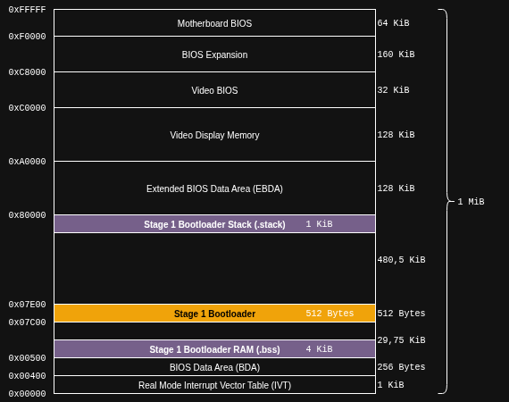

# Stage 1 Bootloader
In this document, the Stage 1 Bootloader for StudyOS is described. Hereby, a couple of background information are provided. However, it is assumed that the following topics are more or less known
 * Real-Mode and Protected-Mode
 * x86 Segmented Memory with Segment-Register

Again, a great source for information about the above mentioned topics is [OSDev Wiki](https://wiki.osdev.org/Expanded_Main_Page). The following links provide some basic information about Protected-Mode and segmented memory.
 * [System Initialization](https://wiki.osdev.org/System_Initialization_(x86))
 * [Real-Mode](https://wiki.osdev.org/Real_Mode)
 * [Protected-Mode](https://wiki.osdev.org/Protected_Mode)
 * [Segmention](https://wiki.osdev.org/Segmentation)
 * [Segment Limits](https://wiki.osdev.org/Segment_Limits)

## PC Startup
After a reset or power-cycle, the i8086 processor starts the execution always on a specific address. This is, written as linear address, the address `0xFFFF0` which is the same address as the address `0xFFFF:0x00000` written with a segment part and an offset. This address is loaded in the Code-Segment register and the Instruction Pointer, whereby the `CS` register (Code Segment) is loaded with `0xFFFF` and the `IP` register (Instruction Pointer) is loaded with `0x0000`.

You can easily prove that both addresses are the same, by calculating for example the linear address of `0xFFFF:0x0000` with the following calculation:

`LinearAddress = (Segment-Address * 16) + Offset`

Hereby, the Segment-Address is the value in the `CS` register and the offset is the value in the `IP` register. Putting those numbers in, we get

`LinearAddress = (0xFFFF * 16) + 0x0000 = 0xFFFF0 + 0x0000 = 0xFFFF0`

Looking at a standard memory map of a PC, we can clearly see, that the address, where the processor starts the execution, is located in the "Motherboard BIOS" section.

> [!NOTE]
> The addresses shown in the memory map are linear addresses and due to no paging or any other memory management concept, those linear address correspond also to physical addresses.


> [!TIP]
> The address `0xFFFF0` is also the same address where GDB pops up when we start a debugging session with QEmu and Eclipse. See [Eclipse Setup](../../tools/Eclipse.md)

The BIOS code, which is executed directly after a reset or power-cycle, usually initializes some hardware and peripherals and starts loading the Master Boot Records from the devices in the search list of the BIOS until a valid boosector is found.

> [!NOTE]
> The described boot process with the initialization by the BIOS is super simplified and only valid for an old/non-modern PC. Modern BIOSes do much more, switch to Protected-Mode and back to Real-Mode and so on. For our purposes, we just look at the simplest one where the BIOS runs in Real-Mode, does some HW stuff and loads our bootsector and starts the execution of the bootsector code.

## Stage 1 Memory Layout
Usually, if you search for simple bootloader, you'll find examples which consists of a single assembly file. This assembly file gets assembled into a `.bin` file and writte into the boot sector of your floppy and et voilá, you system is able to start the boot sector during bootup.

This process is also explained in [Babystep 1](https://wiki.osdev.org/Babystep1) from OSDev Wiki. Hereby, the boot loader source file contains also the signature, fill bytes and the actual code. The assembly process with NASM is pretty simple

```
$ nasm boot.asm -f bin -o boot.bin
```

After assembling the source file into a `.bin` file, it can be written to the floppy disk

```
$ dd if=boot.bin of=/dev/fd0
```

And the bottomline of this story is: This works great and you get a working bootloader. But for my purposes, I wanted to utilize the GNU Toolchain and some Linux tools with their great features and capabilities. Therefore, I used, beside the actual bootloader source file, also a Linker Script for the Linker and commandline tools to create the floppy image including signature bytes and partition table.

## Linker Script
One big advantage of using a Linker Script is, that you have full control and a maximum flexibility about the memory layout you want to use. Another hot topic is: With the Linker Script and some assembly coding guidelines it is possible to utilize the "Dead Code Elimination" feature from the linker. That feature makes it possible to use libraries and include their functions, even in the bootloader, and finally, only the called/used functions are kept in the binary. If you split your code across different source files and use the assembler `.include` directive (doesn't matter if its NASM oder GNU Assembler) all functions will be part of the binary, independent whether they get called or not.

### Memory Map
As a foundation for the Linker Script, I created a memory map which I would like to use for my Stage 1 bootloader. The memory map is shown in the following picture.



In principle, there are 3 major memory areas which are related to the Stage 1 bootloader.

| Memory Area   | Memory Section      | Usage                                                             |
| ------------- | ------------------- | ----------------------------------------------------------------- |
| Stage 1 Code  | `.text` and `.data` | Contains the actual bootloader code and the initialized variables |
| Stage 1 RAM   | `.bss`              | Contains the RAM section which is used for unitialized variables  |
| Stage 1 Stack | `.stack`            | Contains the RAM memory which is used for the stack               |

#### Stage 1 Code
The bootloader code is loaded into the memory by the BIOS. Hereby, the BIOS uses the fixed target address `0x007C0` to load the bootloader respectivly the 512 Bytes from the boot sector. This address cannot be modifed and therefore, we have to put our `.text` section at this address.

Another important aspect of this memory area is, that is must also contain our initialized variables. The reason for that is: A variable is just a location in the RAM (it must be writeable and readable). But after a reset/powercycle the RAM usually has undefined content and the question now is, how do we get our initial values into this memory area after a reset/powercycle?
For the Stage 1 bootloader this is pretty simple: The BIOS loads the complete boot sector into the RAM of the PC (at the specified location) and due to the fact that it is loaded into RAM, we can use any memory location as a variable. So what we do now, is just put our initial values, together with the code, in the boot sector which is loaded by the BIOS into memory. However, we need to consider the limited space we have in the boot sector and every initialized variable reduces the available code space. To distinguish between the actual code and the initial values, we use different sections. The code goes into `.text`  whereby the inital values for variables goes into `.data`.

#### Stage 1 RAM
The bootloader needs also sometimes variables to store information and data for further processing. This is realized by providing a `.bss` section where the assembler can put variables in. This memory section is not initialized. But due to the fact that it is not initialized, we can use much more than we have in the `.data` section because we can place the `.bss` section in any unsued memory area of the PC.

For the Stage 1 bootloader I put the `.bss` memory section in a unused memory area between the BIOS Data Area and the bootloader code itself. The reserved area occupies 28 KiB. This is way too much for the Stage 1 bootloader but we will also re-use this area for Stage 2.

#### Stage 1 Stack
This memory area is really super special and completely unusual for a bootloader. In most simple bootloaders, only the Stack-Pointer of the processor is set to a fixed address and starting on this address, the processor manages the Stack-Pointer during `push` and `pop` instructions.

Based on my experience on embedded system, I'm used to pay special attention to the stack memory. And a good practice in embedded systems is to place the stack memory at the end of a RAM area because in most cases, the processors implement a descending stack, which means for each `push` operation onto the stack, the stack pointer is decremented and therefore moves from higher to lower addresses.
But instead to just initialize the processors's stack pointer, I decided to get some support from the linker during address calculation and therefore I can move my stack area around the memory by just adapting the Linker Script and I don't have to change my code for the bootloader.

### Common Linker Script Definitions
Looking at the Linker Script [`src/bootloader/stage1/stage1.ld`](../../../src/bootloader/stage1/stage1.ld), a lot of symbol definitions take place right in the beginning of the file. This is the same concept as for any other source file: Don't use magic numbers, instead try to use symbols and constants

```
/*
 * Defines the start address and size of the Stage 1 bootloader
 * These values are pre-defined by the BIOS and cannot be changed
 */
BOOT_ADDRESS        = 0x7C00;
BOOTLOADER_LENGTH   = 440;

/*
 * Defines the memory address for the Stage2 bootloader. The Stage1
 * bootloader will load the binary of the Stage2 bootloader into this
 * memory address and jumps to this address to execute Stage2
 */
BOOTLOADER_STAGE2_ADR     = 0x7E00;
BOOTLOADER_STAGE2_OFFSET  = 0x0;
BOOTLOADER_STAGE2_SEGMENT = (BOOTLOADER_STAGE2_ADR - BOOTLOADER_STAGE2_OFFSET) / 16;
BOOTLOADER_STAGE2_LENGHT  = 64K;

/*
 * Defines the start address and size for the RAM used by the Stage1
 * Bootloader. This covers the .bss section The .data section contains
 * initialized variables and must be loaded into memory. Therefore the
 * .data section must reside in the bootloader binary
 */
BOOT_RAM_ADR        = 0x0500;
BOOT_RAM_SIZE       = 28K;

/*
 * Defines the address (offset and segment) and size of the Stack for Stage1
 * Bootloader.
 * Remark: This is an address > than 16 Bit and must be recalculated in segement/
 * offset pair for usage in the bootloader code. The Linker can handle the adress
 * calculations for the stack with more than 16 Bit.
 */
BOOT_STACK_ADR      = 0x7FC00;
BOOT_STACK_SIZE     = 1K;

/*
 * Define the offset for the stack segment (Offset 0x400 = 1 KiB --> Last address in Stack)
 * and calculate the corresponding segment for the physical address of the stack
 * based on the chosen offset
 */
BOOT_STACK_OFFSET   = 0x0;
BOOT_STACK_SEGMENT  = (BOOT_STACK_ADR - BOOT_STACK_OFFSET) / 16;
```
As it can be seen in the code snippet, all major addresses for Code, RAM and Stack are hard-coded in the linker file. These addresses, to be more precise, the actual symbols are used in the next step to define a memory structure for the Linker.

### Memory Areas
In the memory structure for the Linker, all the memory areas, shown in the memory map picture, are defined. There is a RAM, Code and Stack area. Additionally, a `DUMMY` area is defined to allow the Linker to store special debug and symbol infos. This memory area is not used by the actual bootloader code, but helps debugging and provides some options to store additional data for tools.

```
MEMORY
{
    /* Memory Areas for Stage1 Bootloader */
    BOOTLOADER_RAM (rw)	: ORIGIN = BOOT_RAM_ADR,        LENGTH = BOOT_RAM_SIZE
    BOOTLOADER (rwx) 	: ORIGIN = BOOT_ADDRESS, 	    LENGTH = BOOTLOADER_LENGTH
    BOOTLOADER_STACK(rw): ORIGIN = BOOT_STACK_ADR       LENGTH = BOOT_STACK_SIZE

    /* Dummy Memory region to store sections not part of the final binary */
    /* The address space of this region doesn't really matter, we should
       just move it our of the way from everything else */
    DUMMY (rwx)         : ORIGIN = DUMMY_ADDRESS,       LENGTH = 10M
}
```

### External Linker Symbols
The next part of the Linker Script defines symbols, which are used in other modules like the actual bootloader code. According to the [Guiding Guidelines](../../development/CodingGuidelines.md), the Linker Symbols for external usage shall have an underscore prefix and lower case letters

```
/* Define the size of the Stack used by the Stage1 Bootloader */
_boot_stack_offset  = BOOT_STACK_OFFSET;
_boot_stack_segment = BOOT_STACK_SEGMENT;
_boot_stack_size    = BOOT_STACK_SIZE;

/* Symbols used in Stage1 Bootloader to setup the complete RAM area */
_ram_start        = ORIGIN(BOOTLOADER_RAM);
_ram_size	      = LENGTH(BOOTLOADER_RAM);

/* Define the addresses (segment + offset) for the Stage2 Bootloader */
_boot_stage2_offset  = BOOTLOADER_STAGE2_OFFSET;
_boot_stage2_segment = BOOTLOADER_STAGE2_SEGMENT;
_boot_stage2_length  = BOOTLOADER_STAGE2_LENGHT;
_boot_stage2_max_sector_count = BOOTLOADER_STAGE2_LENGHT / 512;
```

### Memory Sections
The last part of the Linker Script is the definition of the output sections for the linker. These output sections configure how and where the linker should put the different portions of the software. The following code snippet just shows an excerpt from the sections

```
SECTIONS
{
    /* .text section containing the Stage1 bootloader code */
	.text :
   	{
        /*
         * Create a symbol to define the memory address of the begining of
         * the MBR. Basically this value is fixed to 0x7C00 but it is more
         * elegant to provide a linker-calculated symbol (also good for cross
         * checking whether the memory layout of the .text sections is correct)
         */
   		_mbr_address = .;

        /* Insert all .text.* input sections */
    	*(.text);
        *(.text.*);
   	} > BOOTLOADER AT > BOOTLOADER

    /* .rodata section containing the read-only (constant) data */
	.rodata :
   	{
        . = ALIGN(4);
        /* Insert all .rodata input sections */
    	*(.rodata);
        . = ALIGN(4);
	} > BOOTLOADER

    /* .data section containing all initialized variables */
	.data :
   	{
        . = ALIGN(4);
        /* Insert all .data input sections */
   		*(.data);

        . = ALIGN(4);
	} > BOOTLOADER
```

Two important aspects are configured in the section definition. The first one is: In which memory area the section should go and the second one is: What content should be in that section.