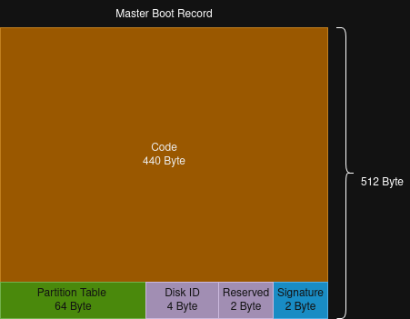
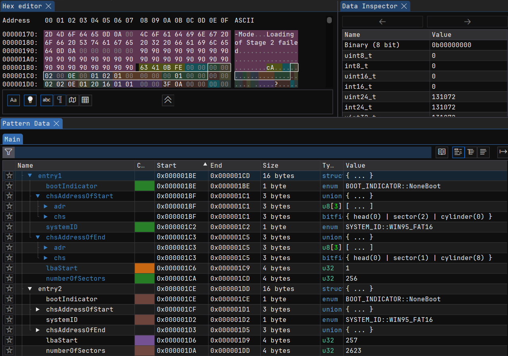

# Bootsector
The bootsector is a special sector (usually 512 Bytes) on a hard disk, floppy disk or partition which contains code and information to boot a system respectively to load and start an operating system.

In most cases the bootsector is used as a synonym for the so called Master Boot Record (MBR). The MBR is the first sector of a hard disk or floppy disk which contains the boot program and a partition table of the disk. In contrast to the MBR, which is the first sector of a disk, the so called _Volume Boot Record_ covers the first couple of sectors of a parition using FAT, HPFS or NTFS filesystem. For example on a FAT32 partition, the VBR uses 3 sectors and on FAT12 and FAT16 partition the VBR is only 1 sector.

The MBR contains, beside the actual start code also some additional information. That are the _Partition Table_, some reserved bytes and a _Signature_.



The biggest part of the MBR contains the actual boot code which is executed after the BIOS has loaded the MBR into memory. Using the ImHex Pattern Language, the structure of the MBR can be defined by the following code snippets. (see [mbr.hexpat](../../tools/imhex/mbr.hexpat))

At first there are some data fields in the MBR where each value has a specific meaning. For example contains the Parition Table Entry the information whether the partition is bootable and it also has information about the used filesystem on the partition. Those special values are defined with some enums.

```c
//
// Boot Indicator Enumeration
// Specifies whether the medium is bootable or not
//
enum BOOT_INDICATOR : u8 {
    NoneBoot = 0x00,        // None bootable disk
    Bootable = 0x80         // Bootable disk
};

//
// System-ID Enumeration
// Specifies the System (e.g. FAT12 or FAT16) of the disk
// IDs based on https://aeb.win.tue.nl/partitions/partition_types-1.html
//
enum SYSTEM_ID : u8 {
    Empty        = 0x00,     // No System ID specified
    DOS_FAT12    = 0x01,     // DOS 12 Bit FAT
    DOS_FAT16    = 0x04,     // DOS 16 Bit FAT
    WIN95_FAT16  = 0x0E      // WIN95: DOS 16-bit FAT, LBA-mapped
};
```

The partition table entries are using CHS and LBA address information to describe the position and size of the partion on the disk. For this, the partition table entry contains information about a Start- and End-Address in CHS format and also a start sector and sector count in LBA addressing.

```c
//
// Bitfield definition for CHS Address information
//
bitfield CHS {
    head       : 8;         // Head Number (zero based)
    sector     : 6;         // Sector Number (one based)
    cylinder   : 10;        // Cylinder number (zero based)
};

//
// Union for CHS Bitfield and single-byte data
//
union CHS_ADDRESS {
    u8 adr[3];              // Single Byte value for CHS filed
    CHS chs;                // Bit-Field decoding of CHS field
};

//
// Structure for a Partition Table Entry
// The Partition Table in the Bootsector consists of 4 Partition Table Entries
//
struct PARTITION_TABLE_ENTRY {
    BOOT_INDICATOR bootIndicator;               // Boot Indicator for bootable disk
    CHS_ADDRESS chsAddressOfStart;              // CHS Address for the Start of the Partition
    SYSTEM_ID systemID;                         // System-ID of the Partition
    CHS_ADDRESS chsAddressOfEnd;                // CHS Address for the End of the Partition
    u32 lbaStart;                               // LBA Address for the Start of the Parition
    u32 numberOfSectors;                        // Number of Sectors in the Partition
};
```
The overall MBR is shown in the following struct definition. As it can be seen, it contains 440 Byte of boot code, some reserved data fields and 4 entries of the parition table.

```c
//
// Structure for the Boot-Code of the Bootsector
//
struct BOOT_SECTOR_CODE {
    u8 code[440];           // Byte Array of the Boot-Code
};

//
// Structure for the Master Boot Record (MBR)
// This is the first sector of a disk (not partition!)
//
struct MASTER_BOOT_RECORD {
    BOOT_SECTOR_CODE code;                      // 440 Byte of Bootsector Code
    u32 diskID;                                 // Unique Disk ID
    u16 reserved;                               // Reserved bytes - Should be 0x0000
    PARTITION_TABLE_ENTRY entry1;               // First Entry in Partition Table
    PARTITION_TABLE_ENTRY entry2;               // Second Entry in Partition Table
    PARTITION_TABLE_ENTRY entry3;               // Third Entry in Partition Table
    PARTITION_TABLE_ENTRY entry4;               // Fourth Entry in Partition Table
    u16 signature;                              // MBR Signature - Should be 0x55 0xAA
};

```
If we use ImHex and the Pattern Language File for the MBR, we can analyse the generated boot disk image for StudyOS and the partition table in this MBR. The following screenshot shows a part of the MBR including the Partition Table with some detail information about the first partition table entry



