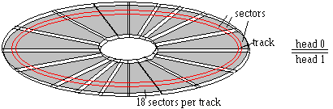

# Floppy Disk
When developing an Operating System or even only a bootloader, it is crucial to understand the physical layout of a floppy disk. The knowledge of the physical layout is also important if you want to use the BIOS API to access a floppy disk and read data from it.

Floppy disk are pretty out-dated but still super interesting because they are easy to understand and also easy to use in the first steps of operating system development. In this article we will only cover 3,5" Floppy Disks with a capacity of 1,44MB.

There is an old page [Operating Systems Development - FDC Programming](http://www.brokenthorn.com/Resources/OSDev20.html) from Mike dated by 2009 which has pretty good information on it. From this page, I've re-used the image of the physical layout of the floppy disk.

The picture above shows the principle layout of the 3,5" floppy disk. The floppy disk consists of a _disk_ which has two different sides. Therefore, the floppy drive also has two separate _heads_ to access each side of the disk. In the picture this is mentions as _head 0_ for the one side and _head 1_ for the other side. Each side of the disk is divided into 80 tracks and each track is divided into 18 sectors.

The naming can sometimes be a little bit confusing because the track on both sides which have the same radius are called _cylinder_.

The following list provides a collection of important information about the disk layout
 * Each disk has 2 sides
 * A floppy drive has 2 heads
 * Each side has 80 tracks
 * Each track has 18 sectors
 * A cylinder is a group of tracks with the same radius
 * Each sector has 512 Byte
 * There are 2880 sectors in total (2 * 80 * 18)

To locate a specific sector on a floppy disk, you have to specify the location like with coordinates. At first, you select the side by defining which head you want to use to access the disk. Then, you specify the track and then you specify the sector number.

## CHS - Cylinder/Head/Sector
The "coordinate system" of the floppy disk which is used by the BIOS API is called CHS. This stands for _Cylinder, Head, Sector_ and allows the specification of an exact sector location on the disk.

Remember, the _Cylinder_ is a group of tracks with the same radius. So for example the Cylinder 3 is the track 3 on side 0 and track 3 on side 1. To select one of those two tracks, you have to specify which head should be used to read the track.

Another important aspect in using CHS addressing for disks is the numbering scheme for the different parts. The following table lists the valid ranges for a typical 3,5" floppy disk

| Address Element | Range       |
| --------------- | ----------- |
| Cylinder        | 0 - 79      |
| Head            | 0 - 1       |
| Sector          | 1 - 18      |

As you can see, the cylinder and head are using a zero-based addressing but the sector uses a one-based counting.

There is also a good article on [OSDev Wiki - Disk access using BIOS](https://wiki.osdev.org/Disk_access_using_the_BIOS_(INT_13h)) where the CHS addressing is also explained.

## LBA - Linear Block Addressing
The LBA addressing scheme is a more modern addressing scheme also used for hard disks. It just uses linear addresses to access a sector on the disk. That means, you can just address LBA 1, 2, 3....553 and so on. To convert from LBA addresses to CHS addresses, there is a simple algorithm

$$C = \frac{LBA}{ST} / NH$$
$$H = \frac{LBA}{ST} \mod{NH}$$
$$S = (LBA \mod{ST}) + 1$$

Hereby, $ST$ is the _Sector per Track_ parameter and $NH$ is the _Number of Heads_ parameter. $LBA$ is used to specify the LBA address which should be converted.