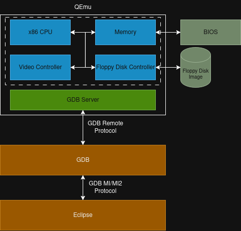

# Eclipse
For the development of StudyOS, as nearly for all other projects I'm working on, I'm using Visual Studio Code as editor and running most tools from the commandline. But if it comes to debugging, I really like the Debug/GDB Interface of Eclipse and usually use this for debugging with GDB.
GDB is super powerfull and for some situations I'm also using the commandline interface of GDB. But to be honest, most of the time the debugging is typically on source level stepping through code and checking variables, memory dumps and CPU register. And exactly for those 90% of debugging activities, I think Eclipse GDB Interface is doing great.

## Setting up the Eclipse Project
Before using the Eclipse GDB interface, a project for StudyOS must be created. This can be done (based on Eclipse C/C++ 06-2025) by importing an "Existing Makefile Project".

If you choose, either from the _File_ menu or from the context menu of the Project Explorer, the command _"Import..."_, you'll get a dialog like the one shown in the following picture


In this dialog, you have to choose _"Existing Code as Makefile Project"_ from the list. The reason why we choose a Makefile project is, that we don't want Eclipse to manage our build system. Even the project type is named "Makefile Project", we could Eclipse configure to use Ninja instead. But for the primary goal of using Eclipse as Debugger Frontend, this is not necessary.

If you click _"Next"_ on the dialog, you will get another dialog where you need to provide some information about the new project.


Hereby, two settings are important. You have to specify a name for the project in the Eclipse Workspace and you have to provide the path to the folder on you filesystem where you've cloned the project.

I would also recommend to select _"Linux GCC"_ as toolchain because this will automatically set some important options for Indexer and ELF Binary handling.

After pressing _"Finish"_, Eclipse will add the project to the Project Explorer.


## Eclipse and QEmu
Due to the fact that we want to develop an Operating System, we need some kind of hardware to run our OS on. To ease the development and increase the debug capabilities we are using a hardware emulation to emulate our target hardware. For this, we gonna use QEmu to emulate an i386 system.

One big advantage of the QEmu emulator is, that it has already a GDB Server integrated which allows us to connect with GDB via a remote target. The following block diagram shows a simplified architecture of QEmu and the GDB/Eclipse integration.



QEmu is emulating a complete PC hardware environment, including the CPU, RAM Memory, Video Controller, Floppy Disk Controller and many more. Beside the internally emulated components, the QEmu virtual PC also contains a BIOS implementation loaded from an external file and one or multiple disk images which are accessed by the virtual floppy disk/disk controller.

The GDB Server component provides a GDB connection via the GDB Remote Protocol directly to the CPU and memory of the virtual PC. This allows a full control of the CPU, even in the very first power up sequence before the BIOS starts.

Eclipse doesn't implement a debugger by its own. Instead it uses a special GDB MI/MI2 protocol to communicate with an external GDB process. With the help of the MI/MI2 protocol, the Eclipse GUI elements can get data from the GDB (like register values, memory dumps, disassemblys etc.) and display them in a nice GUI. Additionally, all control commands for a debugger like _step over_, _step into_ or _continue_ can be sent to GDB.

>[!IMPORTANT]
> You always need an GDB for the target architecture to debug with Eclipse. Eclipse doesn't integrate a GDB, it just provides a nice GUI to interact with a GDB process.

## External Tool Configuration QEmu Real-Mode
As mentioned in the article about [QEmu in Real-Mode](QEmu.md), debugging in Real-Mode with QEmu and GDB is not that straight forward as it looks like. I'm using the patched version of QEmu for debugging my Real-Mode part and the original QEmu version for debugging the Protected-Mode part.

To use QEmu for our OS development respectively for the debugging, we need to configure QEmu as external tool inside Eclipse. Well, this is not really necessary. You can also run QEmu from command line and attach the Eclipse debugger to it, but I found it convinient to handle QEmu and Debugger in one Eclipse GUI.

Create a new _"External Tool Configuration"_ in Eclipse and provide the following settings to it


| Setting            | Description                                          |
| ------------------ | ---------------------------------------------------- |
| Name               | Provide a meaningful name for the Tools. Hereby, I'm using also the information "Real Mode" in the name |
| Location           | This is the absolute path to the program which should be launched. As you can see in the screenshot, I've provided the path to a patched QEmu version for i386 systems |
| Working Directory  | For the working directory you should provide the _build_ directory of the project, because this makes the setting of commandline paramter for QEmu easier. If the build directory cannot be selected via the _"Browse Workspace"_ button, you have to run the Meson setup command first |
| Arguments          | In this text field you must specify the commandline options for QEmu |

The different commandline options for GDB are explained in more detail in the following table.

| Option               | Description                                           |
| -------------------- | ----------------------------------------------------- |
| `-s`                 | Accept GDB connections on tcp::1234. This is a shorthand for the commandline option `-gdb tcp::1234` |
| `-S`                 | Do not start the CPU at startup. This is important, because otherwise the system starts and boots up, without the control of the debugger. With this option set, the system waits for the debugger and we can control when the system should start via the debugger |
| `-fda <FloppyImage>` | This options specifies the image file which should be used for floppy disk A: |
| `-boot order=<Drive>`| Specifies the boot order of the different devices. Hereby, we specify only to boot from drive A: |
| `-no-fd-bootchk`     | Disable the check of the boot signature for the boot drive |
| `-D <Log File>`      | Specifies a filename which is used for log outputs from QEmu |

## External Tool Configuration QEmu Protected-Mode
The external tool configuration for QEmu for Protected-Mode is very similar to what we did for the Real-Mode. The main difference is only the QEmu program executeable we specify. As already mentioned, for Real-Mode I've used a patched QEmu version for correct Code-Segment and Stack-Segement handling, but for Protected-Mode we can use the default version of QEmu.


As you can see in the screenshot above, nerla all setting are the same. Except the _Location_ is pointing to the original (offical QEmu build). _Working Directory_ and _Arguments_ are the same as for Real-Mode

## Eclipse Debug Configuration Real-Mode
To debug our OS respectively at first our bootloader in Real-Mode, we need to create a Debug-Configuration in Eclipse. Hereby, we have to create a _"GDB Hardware Debugging"_ configuration with some specific settings. The following screenshot shows the first configuration page of the Real-Mode Debug Configuration.


The important settings for this Debug Configuration are:
 * **Name**: Name to identify the debug configuration. I've also used the suffix "Real-Mode"
 * **Project**: Must be the project you created for StudyOS
 * **C/C++ Application**: If you click on _"Search Project..."_ you get a dialog which shows all detected binaries which can be used for debugging. If this dialog is empty, you might have not set the "Linux GCC" toolchain for importing the Makefile Project. In this case, you could also browse the filesystem to select the ELF binary. Important: This ELF binary is only used for debug information and debug symbols because our bootloader/OS which will be loaded by QEmu is located on the external disk image
 * **Build before launching**: I didn't configure Eclipse to use Ninja build for the project and therefore I deactivated the auto build feature


On the second page of the Debug Configuration dialog you have to specify the debugger and the remote connection to the target.


Hereby, the _gdb_ debugger is selected by default and due to the _GDB Hardware Debugging_ configuration type, the remote connection is also already setup correctly.

A couple of additional, important settings must be made on the third page of the Debug Configuration dialog.


To get a better Real-Mode debugging experience and to have a couple of convinient custom commands in GDB, a special GDB Script is loaded during the debugger intialization. The `gdb_startup_real_mode.cfg` script provides some settings for real-mode and also loads a GDB script with custom commands.

It is important to deactivate the option _"Load Image"_ because normally, GDB would load the binary image onto our target. But due to the fact that QEmu will load our OS binary from an external disk image, we must not load the binary onto the target. But to have all the debugging information available, we need to activate the option _"Load symbols"_ from our project ELF binary.

The following code snippet shows the default `gdb_startup_real_mode.cfg` file. This GDB Script loads a Real-Mode helper script (based on [GDB Real Mode Script](https://github.com/kvakil/0asm/blob/master/gdb-real-mode) from Hugo Mercier) and sets some architecture relevant settings.

```
# Source the initialization file for GDB in Real-Mode
source tools/debug/gdb_init_real_mode.cfg

# Architecture and Target System configuration
set architecture i8086
set tdesc filename tools/debug/target.xml

# Breakpoint at bootloader start address of BIOS
break *0x7C00
```

Additionally, the script sets a breakpoint at the start address of the Stage 1 Bootloader where the BIOS will start the execution after loading it from Sector 1 of our disk image.

We can also use this script later to load additional symbol files for debugging, if we want to debug Stage 1 and Stage 2 at the same time.

## Start Debugging
Before you can start the debugging session of the Stage 1 Bootloader in Real-Mode, you have to start QEmu with the correct configuration. After you started QEmu for Real-Mode, a QEmu window will pop-up and the Eclipse console shows some warning from QEmu due to the file format of the floppy image.


QEmu doesn't show any output from a BIOS or anything else regarding the boot process. The reason for this is, that we specified the option to wait for a debugger to connect and do not start the execution process directly after launch.

As soon as QEmu is running and waiting of a debugger connection, we can launch the Eclipse Debug configuration for Real-Mode we already prepared. After a successfull connect of GDB to the QEmu remote target, Eclipse either asks to switch to the Debug Perspective or does this automatically. After Eclipse switched to the Debug perspective, you should get a more or less simular screen like the one in the following screenshot (the window layout might be different due to your personal configuration)


As you can see, Eclipse has stopped with the Debugger at an position where the CPU will start the execution (usually the BIOS will start now and initializes the hardware). Now, if we continue with the Debugger, the CPU will start the execution of the BIOS code and the BIOS will initialize everything necessary for boot up, loads the first sector from the provided boot disk and jumps to the pre-defined execution position for the bootloader.


To continue with the debugger, you just need to press the green "play button" in the debugger toolbar in Eclipse. As you might remember, we set a breakpoint in the GDB startup script at address `0x7C00`. This is the default address where the BIOS will load our bootloader and starts execution. That means, as soon as we hit continue in the debugger, we should stop at our breakpoint in the bootloader.


As you can see, we stopped at the first instruction of our Stage 1 bootloader. One important aspect here is, that we are currently debugging on Source-Level (even it is still assembler). This is possible because of the ELF binary with debug symbols we specified for the Debug-Configuration. Otherwise you would have to debug on a Disassembly level.