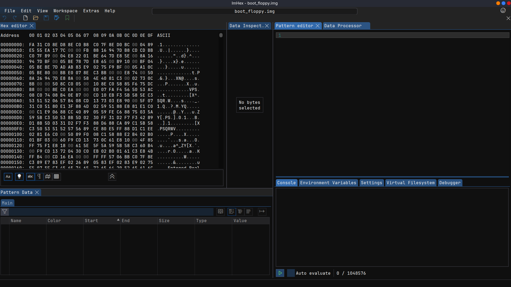
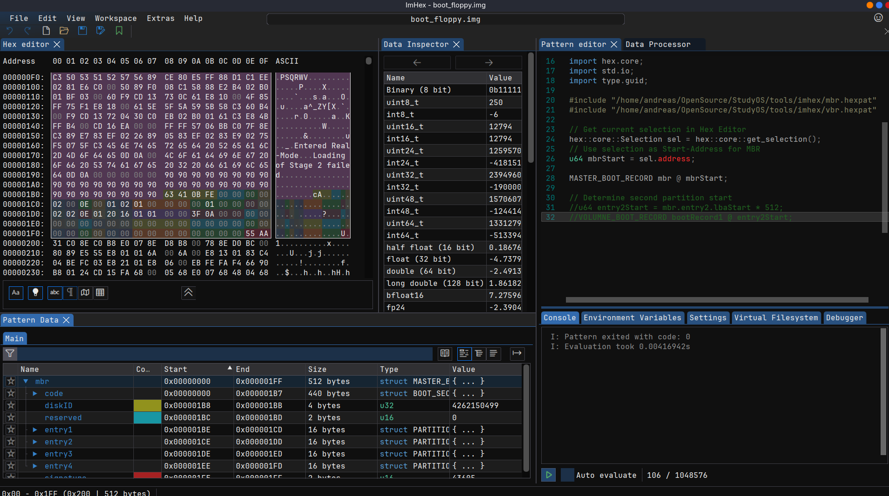

# ImHex Hex-Editor
The [ImHex](https://github.com/WerWolv/ImHex) Hex Editor is in my oppinion the best hex editor out there! It has so many features which make it very comfortable to work with binary data and doing low-level stuff.

I'm using ImHex to check my disk images and cross check the generated binaries on my disk image. One really good feature of ImHex is the so called _Pattern Language_ where you can define binary data structures based on a specific language and ImHex is displaying the decoded information in a visual way where you can easily browse your data.

## Bootsector with ImHex
The StudyOS repository also contains some pattern files for different parts of the disk image. For exmaple there is a pattern file for the _Master Boot Record (MBR)_ and also the _Volume Boot Record (VBR)_ where you can analyse the corresponding sectors on disk.

To have there more flexibility, I used the _include_ concept of the pattern language to separate the specific data structure definition from the actual display and analyzing task. Unfortunately, the include directive of the Pattern Language doesn't allow relative paths and therefore, I had to hard code the absolute path to the files in the Pattern Language files. So you have to adapt those settings if you want to use the files.

If you load the floppy disk image into ImHex without any additional Pattern Language, you get a view similar to the following screenshot

The boot disk image is a binary file representing the complete physical floppy disk. Therefore, the file is 1,44MB in size and the first 512 Byte contain our bootsector which is loaded by the BIOS during the boot process.

If we load the pattern file `studyos_disk_image.hexpat`, ImHex will analyse the loaded binary, beginning on the current cursor location based on the defined data structures in the Pattern File. For demonstration purposes, I've deactivated the Volume Boot Record analsis and only activated the Master Boot Record. The following picture shows the visualiazion of the different areas in the MBR including code, partition table and signature.

